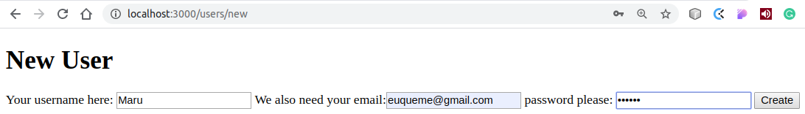
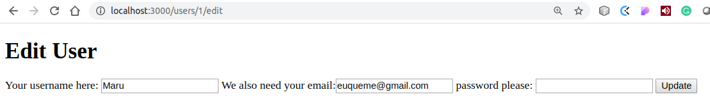

<!--
*** Thanks for checking out this README Template. If you have a suggestion that would
*** make this better, please fork the repo and create a pull request or simply open
*** an issue with the tag "enhancement".
*** Thanks again! Now go create something AMAZING! :D
-->

<!-- PROJECT SHIELDS -->
<!--
*** I'm using markdown "reference style" links for readability.
*** Reference links are enclosed in brackets [ ] instead of parentheses ( ).
*** See the bottom of this document for the declaration of the reference variables
*** for contributors-url, forks-url, etc. This is an optional, concise syntax you may use.
*** https://www.markdownguide.org/basic-syntax/#reference-style-links
-->
[![Contributors][contributors-shield]][contributors-url]
[![Forks][forks-shield]][forks-url]
[![Stargazers][stars-shield]][stars-url]
[![Issues][issues-shield]][issues-url]

<!-- PROJECT LOGO -->
 

  

  <h3 align="center">Bare Metal Forms and Helpers</h3>

  

    This project is part of the Microverse Ruby on Rails curriculum!
     
    <a href="https://github.com/euqueme/re-former"><strong>Explore the docs »</strong></a>
     
     
    <a href="https://github.com/euqueme/re-former/issues">Report Bug</a>
    ·
    <a href="https://github.com/euqueme/re-former/issues">Request Feature</a>
  

<!-- TABLE OF CONTENTS -->
## Table of Contents

* [About the Project](#about-the-project)
  * [Built With](#built-with)
  * [Usage](#usage)
  * [Automated Test](#automated-test)
* [Author](#author)
* [Contributing](#contributing)
* [Acknowledgements](#acknowledgements)

<!-- ABOUT THE PROJECT -->
## About The Project

This project is about building a form from the html way to the rails way using the rails form helpers

This is the fifth Microverse project of the Ruby on Rails Curriculum

This is also part of the Odin project curriculum https://www.theodinproject.com/courses/ruby-on-rails/lessons/forms

### Built With
This project was built using these technologies.
* Ruby 2.6.3
* Rails 6.0.2.1
* Ubuntu 18.4+
* Stickler
* VsCode

<!-- ABOUT THE PROJECT -->
### Usage

If you want to try it out you need to have Ruby and Rails installed in your computer and [download](https://github.com/euqueme/re-former/archive/master.zip) or clone this repo as follows:
* `$ git clone "https://github.com/euqueme/re-former.git"`

cd to the re-former directory and then, after that you need to open a terminal inside the repo and run the bundler
* `$ bundle  install --without production`

run rails db:migrate. This creates the database with the corresponding tables, columns and associations.
* `$ rails db:migrate`

finally, run the server
* `$ rails server`

and try out the [new](http://localhost:3000/users/new) 

and [edit](http://localhost:3000/users/1/edit) (you have to create an user first to see this page)

<!-- AUTOMATED TEST -->
### Automated Test

> There are no Automated Test for this project yet

<!-- CONTACT -->
## Author

👤 **Audrey Emmanuella Odiaka** 
- Twitter: [@o___audrey_xo](https://twitter.com/o___audrey_xo) 
- Github: [@audrey-ella-xo](https://github.com/audrey-ella-xo) 
- Gmail: anitaudrey@gmail.com

👤 **María Eugenia Quemé** 

- Twitter: [@MaruKK](https://twitter.com/MaruKK) 
- Github: [@euqueme](https://github.com/euqueme) 
- Gmail: euqueme@gmail.com

## 🤝 Contributing

Contributions, issues and feature requests are welcome!

Feel free to check the [issues page](https://github.com/euqueme/micro-reddit/issues).

## Show your support

Give a ⭐️ if you like this project!

<!-- ACKNOWLEDGEMENTS -->
## Acknowledgements
* [Microverse](https://www.microverse.org/)
* [The Odin Project](https://www.theodinproject.com/)

<!-- MARKDOWN LINKS & IMAGES -->
<!-- https://www.markdownguide.org/basic-syntax/#reference-style-links -->
[contributors-shield]: https://img.shields.io/github/contributors/euqueme/re-former.svg?style=flat-square
[contributors-url]: https://github.com/euqueme/re-former/graphs/contributors
[forks-shield]: https://img.shields.io/github/forks/euqueme/re-former.svg?style=flat-square
[forks-url]: https://github.com/euqueme/re-former/network/members
[stars-shield]: https://img.shields.io/github/stars/euqueme/re-former.svg?style=flat-square
[stars-url]: https://github.com/euqueme/re-former/stargazers
[issues-shield]: https://img.shields.io/github/issues/euqueme/re-former.svg?style=flat-square
[issues-url]: https://github.com/euqueme/re-former/issues
